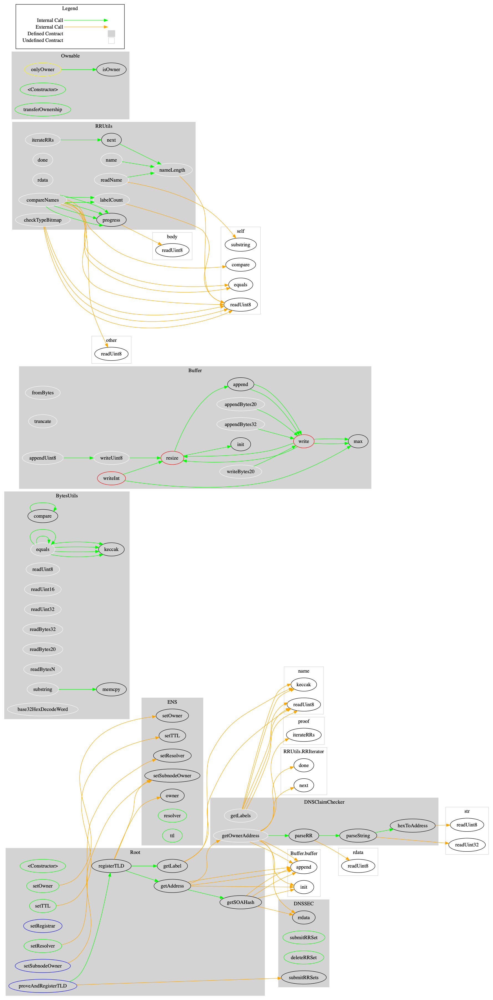

## Sūrya's Description Report

### Files Description Table

|  File Name  |  SHA-1 Hash  |
|-------------|--------------|
| root/contracts/Migrations.sol | eac3bb098bace681296263c037b30123fd46e01a |
| root/contracts/Ownable.sol | b596da7ad9b5c92a119268e05a5f2190659de8d3 |
| root/contracts/Root.sol | 94c5fd45635c6d78cae15903bdf565e2c587bdfa |
| ethregistrar/contracts/BaseRegistrar.sol | dfadfc8a35024069ff66cbc4a82b67dc48129eab |
| ethregistrar/contracts/BaseRegistrarImplementation.sol | a1e04ce66a9588063155591b59cd695d2d35cabe |
| ethregistrar/contracts/DummyOracle.sol | e1dab33211d55e02874ae2510e5e773e13056939 |
| ethregistrar/contracts/ETHRegistrarController.sol | 7cb180a1d5102efd2acc04b0b518848b6127846e |
| ethregistrar/contracts/Migrations.sol | b6732a145e4cb6841945488f591b1cf383a6441e |
| ethregistrar/contracts/PriceOracle.sol | 3257acda730f294f19984163f9fe4a19eabdef4d |
| ethregistrar/contracts/SafeMath.sol | 5effc6db2209b2bf2d49abe4ad1ac247e106f8d9 |
| ethregistrar/contracts/SimplePriceOracle.sol | fc11bff8c93e8471b8d8478f1a14b7f43fff2eef |
| ethregistrar/contracts/StablePriceOracle.sol | 892333542a757ba6089c5c3d19d00b337cb0da78 |
| ethregistrar/contracts/StringUtils.sol | 4d784bb26b409cfd8ed841f43c4e0ffbfddc450b |
| ethregistrar/contracts/_TestDeps.sol | 2077d541fedbd889d2f814c5c51aa046078f566d |

### Contracts Description Table

|  Contract  |         Type        |       Bases      |                  |                 |
|:----------:|:-------------------:|:----------------:|:----------------:|:---------------:|
|     └      |  **Function Name**  |  **Visibility**  |  **Mutability**  |  **Modifiers**  |
||||||
| **Migrations** | Implementation |  |||
| └ | \<Constructor\> | Public ❗️ | 🛑  | |
| └ | setCompleted | Public ❗️ | 🛑  | restricted |
| └ | upgrade | Public ❗️ | 🛑  | restricted |
||||||
| **Ownable** | Implementation |  |||
| └ | \<Constructor\> | Public ❗️ | 🛑  | |
| └ | transferOwnership | Public ❗️ | 🛑  | onlyOwner |
| └ | isOwner | Public ❗️ |   |NO❗️ |
||||||
| **Root** | Implementation | Ownable |||
| └ | \<Constructor\> | Public ❗️ | 🛑  | |
| └ | proveAndRegisterTLD | External ❗️ | 🛑  |NO❗️ |
| └ | setSubnodeOwner | External ❗️ | 🛑  | onlyOwner |
| └ | setRegistrar | External ❗️ | 🛑  | onlyOwner |
| └ | registerTLD | Public ❗️ | 🛑  |NO❗️ |
| └ | setResolver | Public ❗️ | 🛑  | onlyOwner |
| └ | setOwner | Public ❗️ | 🛑  | onlyOwner |
| └ | setTTL | Public ❗️ | 🛑  | onlyOwner |
| └ | getLabel | Internal 🔒 |   | |
| └ | getAddress | Internal 🔒 |   | |
| └ | getSOAHash | Internal 🔒 |   | |
||||||
| **BaseRegistrar** | Implementation | ERC721, Ownable |||
| └ | addController | External ❗️ | 🛑  |NO❗️ |
| └ | removeController | External ❗️ | 🛑  |NO❗️ |
| └ | nameExpires | External ❗️ |   |NO❗️ |
| └ | available | Public ❗️ |   |NO❗️ |
| └ | register | External ❗️ | 🛑  |NO❗️ |
| └ | renew | External ❗️ | 🛑  |NO❗️ |
| └ | reclaim | External ❗️ | 🛑  |NO❗️ |
| └ | acceptRegistrarTransfer | External ❗️ | 🛑  |NO❗️ |
||||||
| **BaseRegistrarImplementation** | Implementation | BaseRegistrar |||
| └ | \<Constructor\> | Public ❗️ | 🛑  | |
| └ | ownerOf | Public ❗️ |   |NO❗️ |
| └ | addController | External ❗️ | 🛑  | onlyOwner |
| └ | removeController | External ❗️ | 🛑  | onlyOwner |
| └ | nameExpires | External ❗️ |   |NO❗️ |
| └ | available | Public ❗️ |   |NO❗️ |
| └ | register | External ❗️ | 🛑  | live onlyController |
| └ | renew | External ❗️ | 🛑  | live onlyController |
| └ | reclaim | External ❗️ | 🛑  | live |
| └ | acceptRegistrarTransfer | External ❗️ | 🛑  |NO❗️ |
||||||
| **DummyOracle** | Implementation |  |||
| └ | \<Constructor\> | Public ❗️ | 🛑  | |
| └ | set | Public ❗️ | 🛑  |NO❗️ |
| └ | read | External ❗️ |   |NO❗️ |
||||||
| **ETHRegistrarController** | Implementation | Ownable |||
| └ | \<Constructor\> | Public ❗️ | 🛑  | |
| └ | rentPrice | Public ❗️ |   |NO❗️ |
| └ | valid | Public ❗️ |   |NO❗️ |
| └ | available | Public ❗️ |   |NO❗️ |
| └ | makeCommitment | Public ❗️ |   |NO❗️ |
| └ | commit | Public ❗️ | 🛑  |NO❗️ |
| └ | register | External ❗️ |  💵 |NO❗️ |
| └ | renew | External ❗️ |  💵 |NO❗️ |
| └ | setPriceOracle | Public ❗️ | 🛑  | onlyOwner |
| └ | withdraw | Public ❗️ | 🛑  | onlyOwner |
||||||
| **Migrations** | Implementation |  |||
| └ | \<Constructor\> | Public ❗️ | 🛑  | |
| └ | setCompleted | Public ❗️ | 🛑  | restricted |
| └ | upgrade | Public ❗️ | 🛑  | restricted |
||||||
| **PriceOracle** | Interface |  |||
| └ | price | External ❗️ |   |NO❗️ |
||||||
| **SafeMath** | Library |  |||
| └ | mul | Internal 🔒 |   | |
| └ | div | Internal 🔒 |   | |
| └ | sub | Internal 🔒 |   | |
| └ | add | Internal 🔒 |   | |
| └ | mod | Internal 🔒 |   | |
||||||
| **SimplePriceOracle** | Implementation | Ownable, PriceOracle |||
| └ | \<Constructor\> | Public ❗️ | 🛑  | |
| └ | setPrice | Public ❗️ | 🛑  | onlyOwner |
| └ | price | External ❗️ |   |NO❗️ |
||||||
| **DSValue** | Interface |  |||
| └ | read | External ❗️ |   |NO❗️ |
||||||
| **StablePriceOracle** | Implementation | Ownable, PriceOracle |||
| └ | \<Constructor\> | Public ❗️ | 🛑  | |
| └ | setOracle | Public ❗️ | 🛑  | onlyOwner |
| └ | setPrices | Public ❗️ | 🛑  | onlyOwner |
| └ | price | External ❗️ |   |NO❗️ |
||||||
| **StringUtils** | Library |  |||
| └ | strlen | Internal 🔒 |   | |

### Legend

|  Symbol  |  Meaning  |
|:--------:|-----------|
|    🛑    | Function can modify state |
|    💵    | Function is payable |

# Root Control Flow

